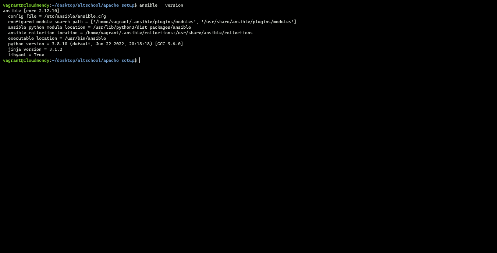
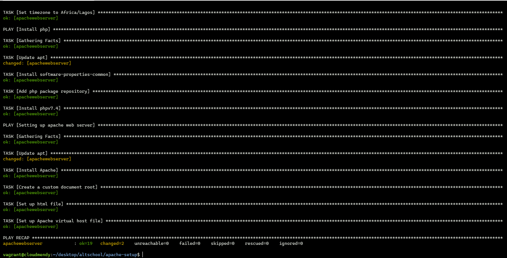
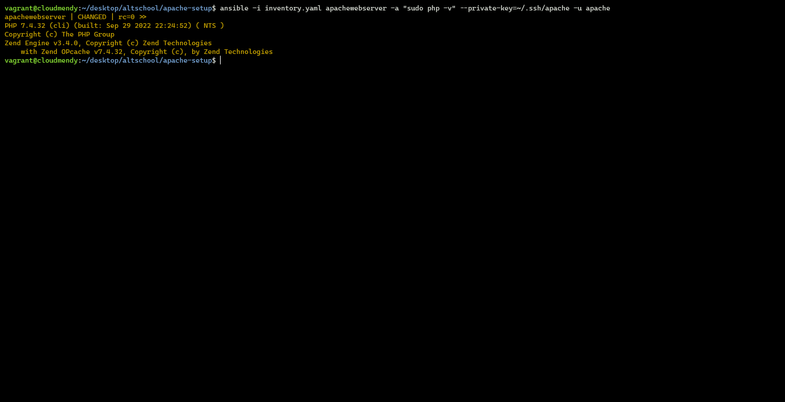
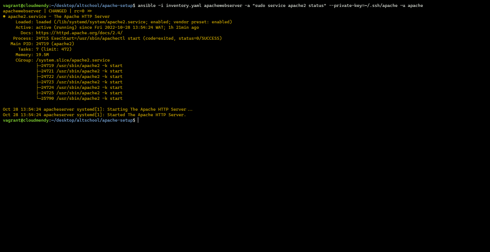

# Setting up an Apache web server using ansible

In a nutshell, server configuration management (also popularly referred to as IT Automation) is a solution for turning your infrastructure administration into a codebase, describing all processes necessary for deploying a server in a set of provisioning scripts that can be versioned and easily reused. It can greatly improve the integrity of any server infrastructure over time.

## Terminologies

- **Control Node:** the machine where Ansible is installed, responsible for running the provisioning on the servers you are managing.
- **Inventory:** an INI file that contains information about the servers you are managing.
- **Playbook:** a YAML file containing a series of procedures that should be automated.
- **Task:** a block that defines a single procedure to be executed, e.g.: install a package.
- **Module:** a module typically abstracts a system task, like dealing with packages or creating and changing files. Ansible has a multitude of built-in modules, but you can also create custom ones.
- **Role:** a set of related playbooks, templates and other files, organized in a pre-defined way to facilitate reuse and share.
- **Play:** a provisioning executed from start to finish is called a play.
- **Facts:** global variables containing information about the system, like network interfaces or operating system.
- **Handlers:** used to trigger service status changes, like restarting or reloading a service.

## Prerequisite

- Host machine/control node - serving as the control node
- guest machine/server - serving as the server that hosts apache
	- Could be a virtual machine. This exercise uses an Azure EC2 instance as the server
- ubuntu18.04/20.04 - linux os to be installed on both machines
- ssh access to a privileged account on the guest machine

## Steps
1. Install and configure ansible on the control node
2. Create an inventory file
3. Create an ansible playbook, which does the following
	- Sets up the server
	- Installs php7.4
	- Installs and configures apache
4. Execute the playbook

### Step 1 - Install and configure ansible on the control node

- Add ansible package repository
```
sudo apt-add-repository ppa:ansible/ansible
```

- Update apt package manager
```
sudo apt update
```

- Install ansible software
```
sudo apt install ansible
```

### Step 2 - Create an inventory file
Inventories organize managed nodes in centralized files that provide Ansible with system information and network locations. Using an inventory file, Ansible can manage a large number of hosts with a single command. Inventories also help you use Ansible more efficiently by reducing the number of command-line options you need to specify. The inventory file file for this exercise looks like this:
```
  1 webServer:
  2   hosts:
  3     apachewebserver:
  4       ansible_host: 102.37.159.72
```

### Step 3 -  Create an ansible playbook
Playbooks are automation blueprints, in YAML format, that Ansible uses to deploy and configure managed nodes. In the context of this exsercise, 3 plays where created.

#### Play 1 - Server set up
```
  1 - name: Server configuration
  3   hosts: webServer
  4   become: true
  5   remote_user: apache
  6
  7   tasks:
  8   - name: Install aptitude
  9     ansible.builtin.apt:
 10       name: aptitude
 11       state: latest
 12       update_cache: true
 13   - name: Disable password authentication for root
 14     ansible.builtin.lineinfile:
 15       path: /etc/ssh/sshd_config
 16       state: present
 17       regexp: '^#?PermitRootLogin'
 18       line: 'PermitRootLogin prohibit-password'
 19   - name: Update apt and install required system packages
 20     ansible.builtin.apt:
 21       pkg: ufw
 22       state: latest
 23       update_cache: true
 24   - name: UFW - ALLOW SSH connections
 25     community.general.ufw:
 26       rule: allow
 27       name: OpenSSH
 28   - name: UFW - Enable and deny by default
 29     community.general.ufw:
 30       state: enabled
 31       default: deny
 32     register: ufw_enabled
 33   - name: UFW - ALLOW HTTP connections
 34     community.general.ufw:
 35       rule: allow
 36       port: 80
 37       proto: tcp
 38     notify: restart ufw
 39     when: ufw_enabled is succeeded
 40   - name: Set timezone to Africa/Lagos
 41     community.general.timezone:
 42       name: Africa/Lagos
 43
 44   handlers:
 45   - name: restart ufw
 46     ansible.builtin.service:
 47       name: ufw
 48       state: restarted 
```
#### Play 2 - php7.4 Installation
```
 50 - name: Install php
 51   hosts: webServer
 52   become: true
 53   remote_user: apache
 54
 55   tasks:
 56   - name: Update apt
 57     ansible.builtin.apt:
 58       update_cache: yes
 59   - name: Install software-properties-common
 60     ansible.builtin.apt:
 61       name: software-properties-common
 62       state: latest
 63   - name: Add php package repository
 64     ansible.builtin.apt_repository:
 65       repo: ppa:ondrej/php
 66       state: present
 67       update_cache: yes
 68     register: php_repo_added
 69   - name: Install phpv7.4
 70     ansible.builtin.apt:
 71       name: php7.4
 72       state: latest
 73       update_cache: yes
 74     when: php_repo_added is succeeded
```
#### Play 3 - Apache installation and setup
```
 76 - name: Setting up apache web server
 77   hosts: webServer
 78   become: true
 79   remote_user: apache
 80   vars:
 81     doc_root: /var/www/apache
 82
 83   tasks:
 84   - name: Update apt
 85     ansible.builtin.apt:
 86       update_cache: yes
 87   - name: Install Apache
 88     ansible.builtin.apt:
 89       name: apache2
 90       state: latest
 91       update_cache: yes
 92   - name: Create a custom document root
 93     ansible.builtin.file:
 94       path: "{{ doc_root }}"
 95       state: directory
 96       recurse: true
 97       owner: www-data
 98       group: www-data
 99   - name: Set up html file
100     ansible.builtin.copy:
101       src: index.php
102       dest: "{{ doc_root }}/index.php"
103       mode: 0644
104   - name: Set up Apache virtual host file
105     ansible.builtin.template:
106       src: vhost.tpl
107       dest: /etc/apache2/sites-available/000-default.conf
108     notify: restart apache
109
110   handlers:
111   - name: restart apache
112     ansible.builtin.service:
113       name: apache2.service
114       state: restarted
115     when: not ansible_check_mode
```

### Results

#### ansible installed


#### ansible playbook success


#### php7.4 installed


#### apache installed and configured


#### index.php hosted successfully


### [Resource - ansible docs](https://docs.ansible.com/)
