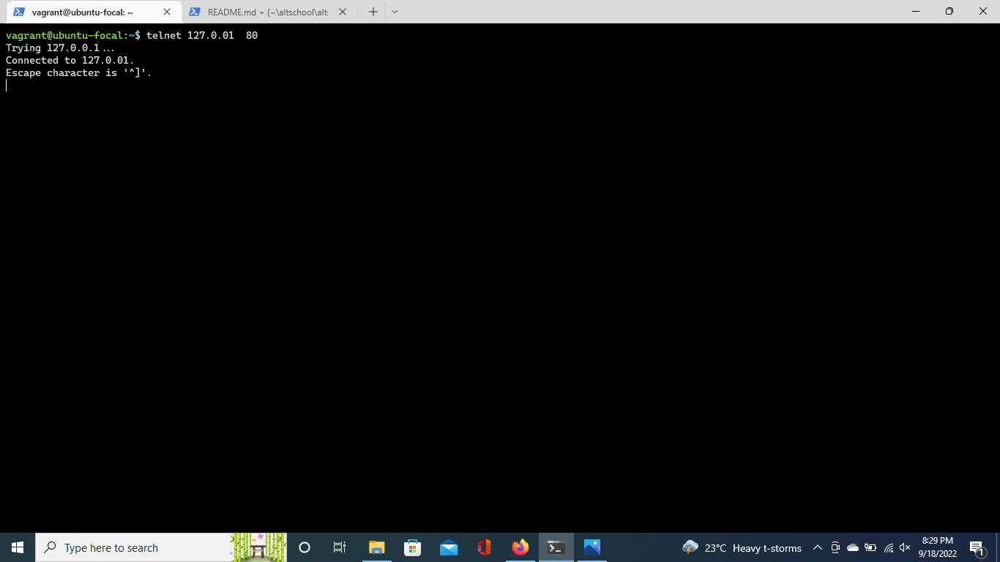
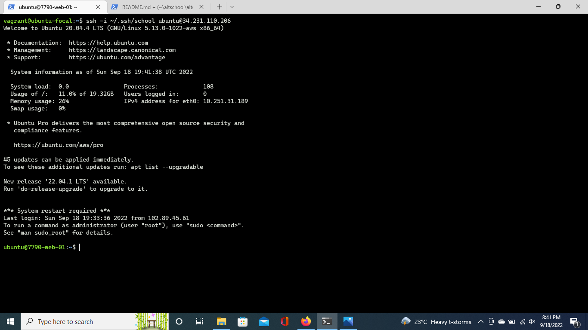
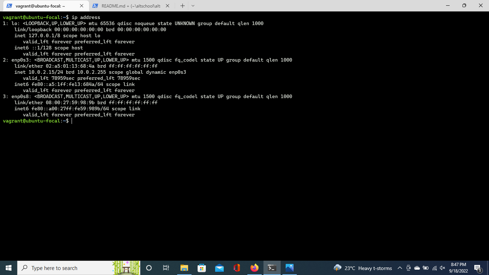
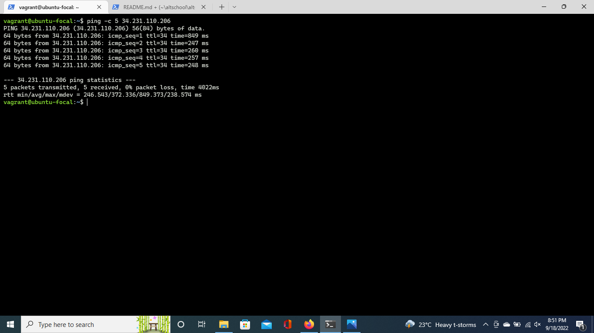
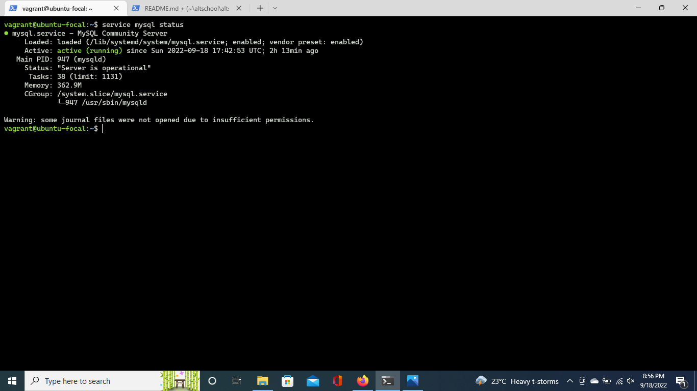
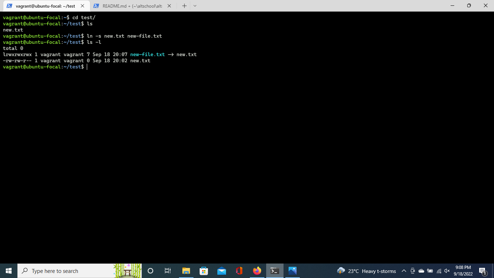
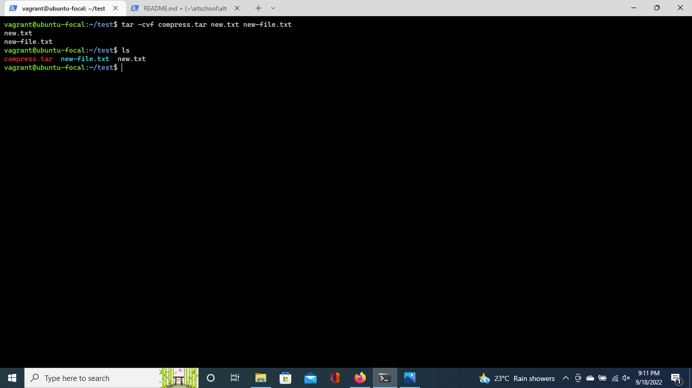
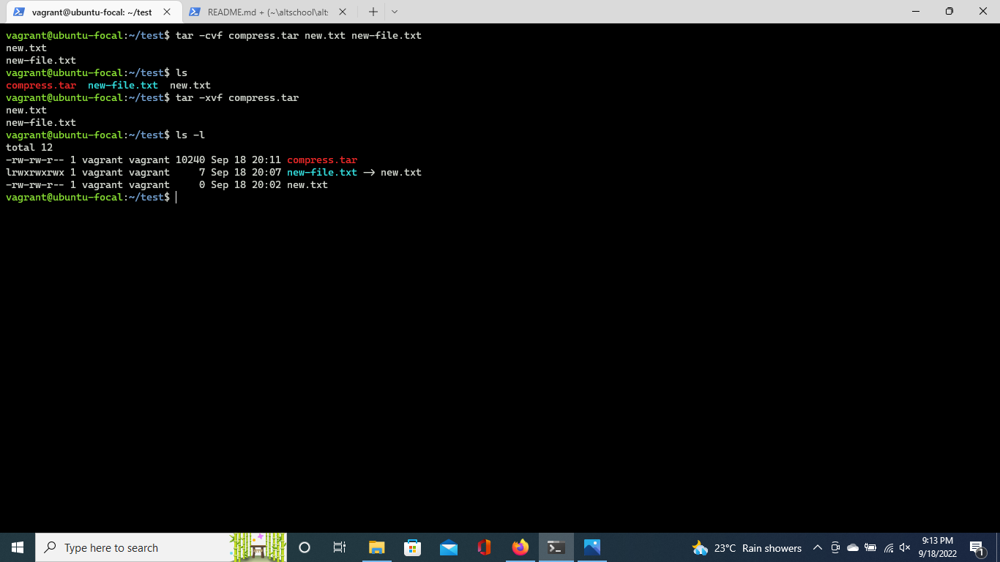
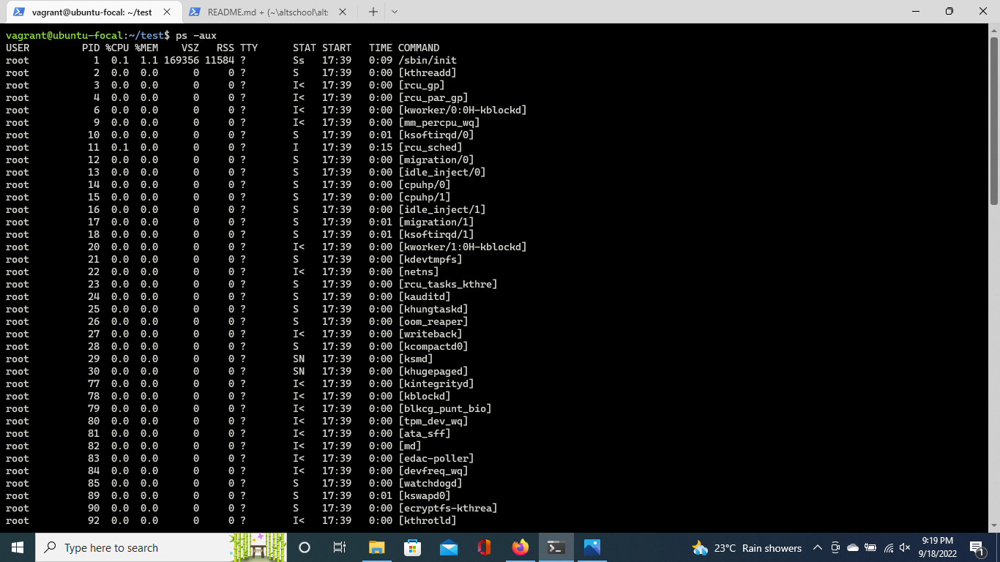
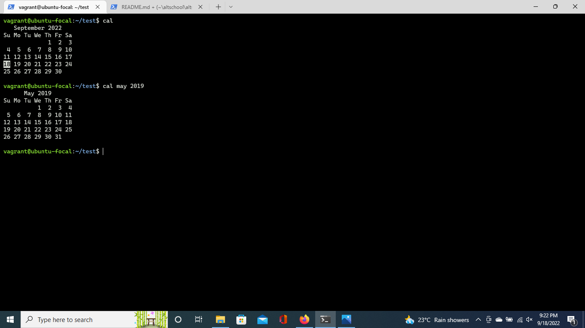

# Linux Commands Practice

## telnet
`telnet` is an old network protocol that is used to connect to remote systems over a TCP/IP network. It connects to servers and network equipment over port 23. Let’s take a look at Telnet command usage.
```
    - Telnet is not a secure protocol and is thus NOT RECOMMENDED!. This is because data sent over the protocol is unencrypted and can be intercepted by hackers.
    - Instead of using telnet, a more preferred protocol to use is SSH which is encrypted and more secure
```
##### telnet installation
`install telnet telnet-server -y`
##### basic `telnet` usage
`telnet [server-ip] [port]`


## ssh
`ssh` is a secure protocol used as the primary means of connecting to Linux servers remotely. It provides a text-based interface by spawning a remote shell.
##### ssh key generation
- Run this command and accept the defaults `ssh-keygen -t rsa`
- Copy the public key to the remote server `ssh-copy-id [/path/to/file] <username>@<remote-host>`
##### basic `ssh` usage
`ssh -i [/path/to/file] <username>@<remote-host>`


## ip
`ip` command in Linux is present in the net-tools which is used for performing several network administration tasks. `ip` stands for `Internet Protocol`. This command is used to show or manipulate routing, devices, and tunnels
##### basic `ip` usage
`ip address` - shows all `ip` addresses associated on all network devices.


## ping
`ping` is a computer network administration software utility used to test the reachability of a host on an Internet Protocol network
##### basic `ping` usage
`ping -c 5 34.231.110.206`


## service
The `service` command is another way to control SysVinit services through SysVinit scripts. It supports the following subcommands:
- `status`, `start`, `stop`, `restart` and `reload`
##### basic `service` usage
`service [options] [service] [subcommand]`


## ln
To create a link to another file, we use the `ln` command. This is one of the important Linux commands that you should know if you’re planning to work as a Linux administrator.
##### basic `ln` usage
`ln -s <source path> <link name>`


## tar
The `tar` command in Linux is used to create and extract archived files in Linux. We can extract multiple different archive files using the tar command.
##### basic `tar` usage
- compress `tar -cvf <archive name> <files seperated by space>`

- extract `tar -xvf <archive name>`


## grep
If you wish to search for a specific string within an output, the `grep` command comes into the picture. We can pipe (|) the output to the `grep` command and extract the required string.
##### basic `grep` usage
`<Any command with output> | grep "<string to find>"`

## ps
`ps` displays information about a selection of the active processes.
##### basic `ps` usage
- List processes in details `ps -aux`


## cal
The `cal` command displays a well-presented calendar on the terminal. Just enter the word cal on your terminal prompt.
##### basic `cal` usage
- display current calendar `cal`, to display custom calender `cal [month] [year]`


