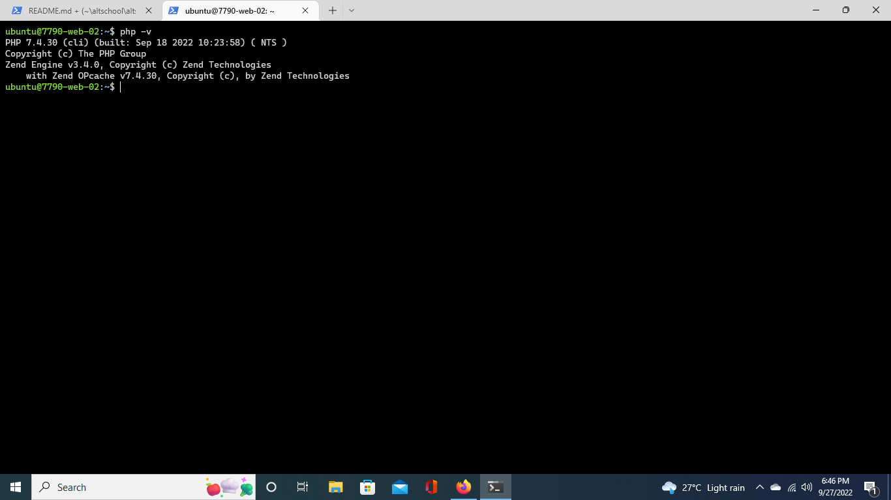

# Application Package Management

The objective of this exercise are as follows

- What is a package.
- What is a package repository.
- Package management tools, `apt`, `dpkg`, `RPM`, etc.
- How to use the `add-apt-repository` command.
- How to use the advanced package tool, `apt`.
- Installing packages from a repository.

### php7.4 Installation
The above [bash script](./php7.4-installation-script), was used to install php7.4 from `ppa:ondrej/php` package repository.
- `sudo apt-get -y update`: ensures that you have access to the latest versions of anything you want to install
- `sudo apt -y install software-properties-common`: adds management for additional software sources
- `sudo add-apt-repository ppa:ondrej/php`: install the repository `ppa:ondrej/php`, which will give you all your versions of PHP
- `sudo apt-get update`: update `apt-get` again so your package manager can see the newly listed packages
- `sudo apt -y install php7.4`: install PHP 7.4

### verify installation success
`php -v`:

### apt repository source list after installation
- [/etc/apt/sources.list](sources.list)
