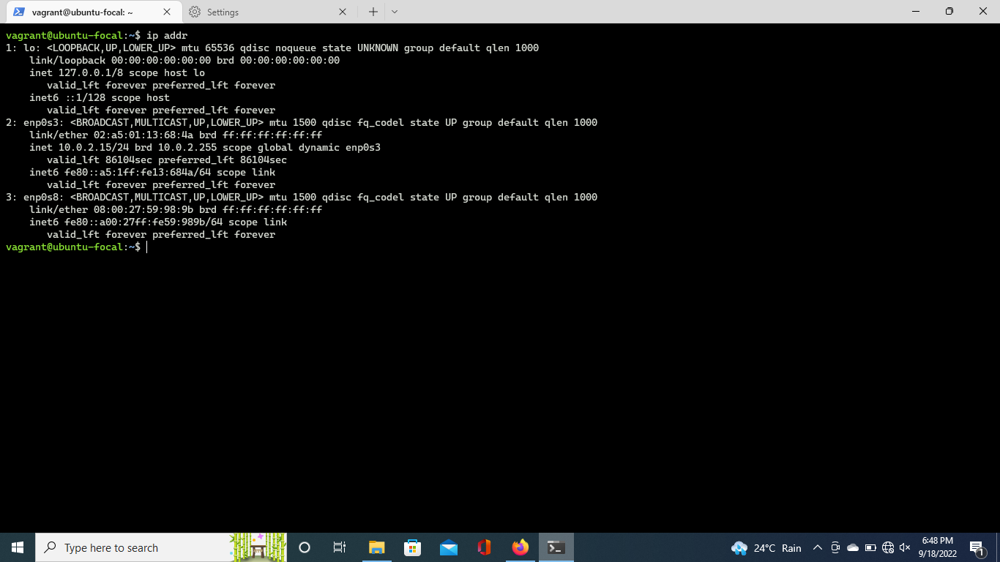

# Setting Up Ubuntu 20.04 LTS on using vagrant and virtaul box

The object of this project is to set up a virtual machine with the following requirements
- Using Vagrant
- Using Oracle's virtualbox
- Ensure Ubuntu 20.04 LTS distro is installed
- Configuring vagrantfile file for `dhcp` (dynamic host configuration protocol)

### dhcp config
[Vagrantfile](./Vagrantfile) successfully configured to allow dhcp

### command => `ip addr`

